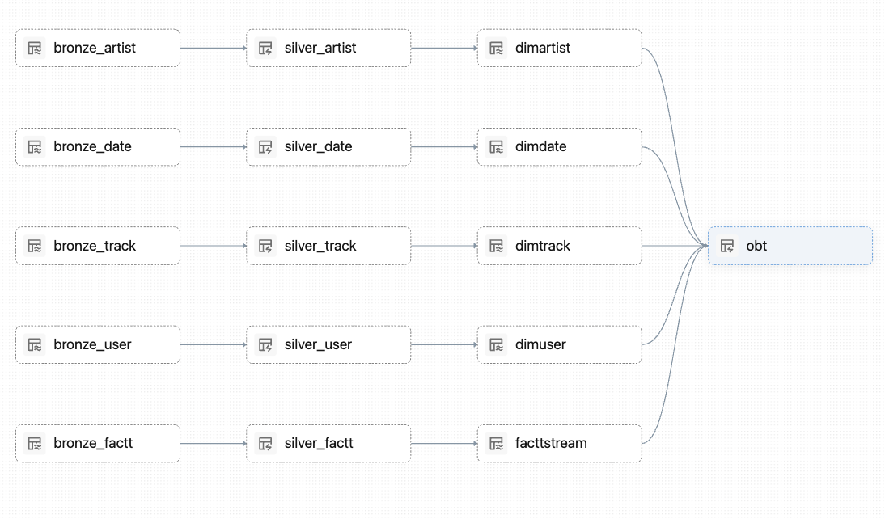

# Project_SDP — Spark Declarative Pipeline 

A production-style, end-to-end **Medallion Architecture** data pipeline built using **Databricks Spark Declarative Pipelines (SDP)**. This project ingests multi-source streaming data from **Amazon S3**, applies layered transformations, and delivers a fully modelled **Gold Layer** with SCD Type 2 history tracking and a One Big Table (OBT) for analytics.

---

## 📌 Table of Contents

- [Overview](#overview)
- [Architecture](#architecture)
- [Pipeline Lineage](#pipeline-lineage)
- [Project Structure](#project-structure)
- [Layers](#layers)
  - [Bronze Layer](#-bronze-layer)
  - [Silver Layer](#-silver-layer)
  - [Gold Layer](#-gold-layer)
- [Tech Stack](#tech-stack)
- [Key Concepts Used](#key-concepts-used)
- [How to Run](#how-to-run)
- [Future Enhancements](#future-enhancements)
- [Created By](#created-by)

---

## Overview

This pipeline processes **music streaming event data** — tracking what songs users listen to, on which devices, for how long, and from where. The pipeline is fully incremental, automatically handling schema evolution, deduplication, and historical change tracking using SCD Type 2.

---

## Architecture

The pipeline follows the **Medallion Architecture** (Bronze → Silver → Gold):

```
Amazon S3 (Raw CSV Files)
        ↓
  🥉 BRONZE LAYER      →  Raw streaming ingestion (multi-source)
        ↓
  🥈 SILVER LAYER      →  Cleaned & transformed data
        ↓
  🥇 GOLD LAYER        →  Dimensional model + SCD Type 2 + OBT
```

---

## Pipeline Lineage

The image below shows the full end-to-end pipeline lineage as seen in Databricks:



> Each node represents a table/view in the pipeline. Arrows show data flow and dependencies — managed automatically by Spark Declarative Pipelines.

---

## Project Structure

```
Project_SDP/
│
├── transformations/              # All SDP pipeline transformation files
│   ├── DimArtist.py              # Gold - Artist dimension (SCD Type 2)
│   ├── DimDate.py                # Gold - Date dimension
│   ├── DimTrack.py               # Gold - Track dimension (SCD Type 2)
│   ├── DimUser.py                # Gold - User dimension (SCD Type 2)
│   ├── FactStream.py             # Bronze + Silver + Gold Fact streaming table
│   └── OBT.py                   # Gold - One Big Table (Materialized View)
│
├── explorations/                 # Notebooks for testing and exploration
│   ├── Testing the Bronze Layer.ipynb
│   ├── Testing Silver Layer.ipynb
│   ├── Testing Gold Layer.ipynb
│   ├── Remove.ipynb
│   └── sample_exploration.py
│
├── utilities/                    # Helper utilities
│
└── README.md                     # Project documentation
```

---

## Layers

### 🥉 Bronze Layer

**Purpose:** Raw ingestion of streaming CSV data from Amazon S3.

The Bronze layer serves as the **raw landing zone** for all incoming data.

- Ingests streaming CSV data incrementally from Amazon S3
- Multi-source ingestion merged into a single unified streaming table
- Raw data preserved as-is with no transformations applied

---

### 🥈 Silver Layer

**Purpose:** Cleaned, validated, and enriched data ready for dimensional modelling.

The Silver layer applies **business-level transformations** on top of Bronze data.

- Cleans, validates and enriches raw data for downstream consumption
- Business logic and derived columns applied to standardise the dataset
- Built as Materialized Views that auto-refresh incrementally when Bronze updates


---

### 🥇 Gold Layer

**Purpose:** Fully modelled dimensional data ready for BI, dashboards, and analytics.

The Gold layer implements a **Star Schema** dimensional model on top of the cleansed Silver data. All dimension tables are managed with **SCD Type 2** using `create_auto_cdc_flow`, ensuring complete historical tracking of any changes to artist, track, user, or date records. The Fact table captures every streaming event with full historical context. A denormalised **One Big Table (OBT)** is provided as a Materialized View, joining all dimensions to the fact table for simplified analytics consumption without requiring complex joins.

#### Dimension Tables (SCD Type 2)
All dimensions are managed using `create_auto_cdc_flow` with `stored_as_scd_type=2`, preserving full historical changes:

| Table | Description |
|---|---|
| `DimArtist` | Artist details including genre |
| `DimTrack` | Track metadata — album, duration, category, release year |
| `DimDate` | Date dimension for time-based analysis |
| `DimUser` | User profile — country, subscription type |

#### Fact Table
| Table | Description |
|---|---|
| `FacttStream` | Streaming events with SCD Type 2 history tracking |

#### One Big Table (OBT)
| Table | Description |
|---|---|
| `OBT` | Materialized View joining all Gold tables for easy analytics consumption |


---

## Tech Stack

| Technology | Purpose |
|---|---|
| **Databricks** | Cloud data platform |
| **Spark Declarative Pipelines (SDP)** | Pipeline orchestration & incremental processing |
| **Apache Spark** | Distributed data processing |
| **Delta Lake** | ACID transactions, schema evolution, time travel |
| **Amazon S3** | Raw data storage (CSV source files) |
| **Python** | Transformation logic |
| **Unity Catalog** | Data governance & cataloging |

---

## Key Concepts Used

- ✅ **Medallion Architecture** — Bronze, Silver, Gold layering
- ✅ **Spark Declarative Pipelines (SDP)** — `append_flow`, `materialized_view`, `create_streaming_table`
- ✅ **Multi-source Streaming Ingestion** — Two S3 sources merged into one Bronze table
- ✅ **SCD Type 2** — Full historical change tracking via `create_auto_cdc_flow`
- ✅ **Incremental Processing** — Automatic, no manual checkpoint management
- ✅ **One Big Table (OBT)** — Denormalized Gold table for analytics
- ✅ **Unity Catalog** — Centralized governance across all layers

---

## How to Run

1. **Set up Databricks workspace** with Unity Catalog enabled
2. **Upload CSV source files** to your S3 bucket
3. **Create the pipeline** in Databricks → Jobs & Pipelines → Create Pipeline
4. **Point source code** to `transformations/` folder
5. **Set default catalog** to `declarative_catalog`
6. Click **Start** to run the pipeline
7. For a clean run from scratch, click **Full Refresh All**

---

## 🔮 Future Enhancements

- Add **data quality expectations** using `@dp.expect` and `@dp.expect_or_drop` across all layers for automated data quality monitoring
- Integrate **real-time event streaming** via Apache Kafka as an additional source alongside S3
- Build **BI dashboards** on top of the Gold OBT using Databricks SQL or Power BI
- Add **alerting and monitoring** for pipeline failures and data quality breaches
- Introduce **data masking and PII handling** for user-sensitive fields in compliance with GDPR
- Automate pipeline scheduling using **Databricks Workflows** for production-grade orchestration

---

## 👨‍💻 Created By

| | |
|---|---|
| **Name** | Utsav Kanani |


---

